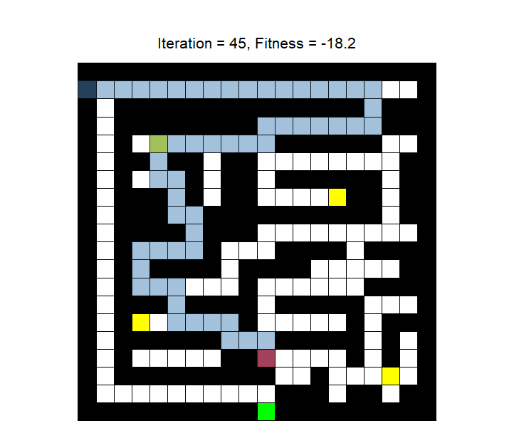
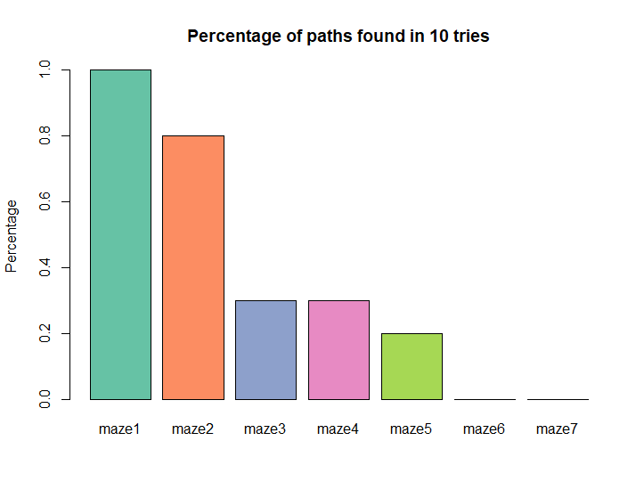

<style>
body { text-align: justify }
</style>

```{r setup, include=FALSE}
knitr::opts_chunk$set(echo = TRUE)
knitr::opts_chunk$set(fig.height=5, fig.width=5, fig.align="center")
library(knitr)
```

\newpage

# Introduction

Genetic algorithms try to mimic the nature's evolution process. Using basic principles of evolution like fitness, mutations and crossovers they are usually used for finding solutions to optimization and search problems.

Initial population of candidates for the solution is generated. Their fitness is evaluated and based on the rating the subjects for mutation and crossover operations are selected. A new generation is created and the process continues until a termination condition is met or the maximum number of iterations has been reached.

In this assignment we tried using the genetic algorithms' optimization properties to optimally solve a maze. We chose to implement the maze path finding algorithm in R programming language using the _[GA](https://cran.r-project.org/package=GA)_ library.

# Representation

The mazes were provided as an array of strings. To make it easier for us to use the data and make it more intuitive we converted the array of strings to a matrix of characters, where '\#' characters represent walls, '.' represent empty spaces, 'T' represent treasures and 'S' and 'E' represent start and finish points of the maze.

```{r}
maze_to_matrix <- function( maze )
{
  nrow <- length( maze )
  ncol <- nchar( maze[1] )
  maze_flat <- unlist( strsplit( maze, '' ) )
  mat <- matrix( maze_flat, nrow, ncol, byrow = TRUE )
  return( mat )
}
```

We chose to represent the path as a vector of integers from 1 to 4, each representing it's own direction. After the genetic algorithm had finished searching for paths the path of the best solution was decoded to characters 'R', 'D', 'L', 'U'.

# Monitoring progress

Since the maze was represented as ASCII characters it was very hard to quickly understand what was going on, particularly during execution of the algorithm. That was especially the case when it was changing every few moments. To make it more visually understandable and pleasing we wrote a monitoring function that plots either the best path or all paths every n-th iteration in a friendlier format as a grid.

```{r, echo=FALSE, out.width="75%"}

```

# Fitness

The fitness function had to be defined so that the better solutions would get a higher rating. Because the path was encoded as a sequence of directions we had to trace the position of the path on the maze from the starting position to evaluate how good a path was.

During path tracing on the maze we checked for wall collisions. Paths through walls are not valid, so the individual is penalized. However, all paths that hit a wall are not equally bad. We decided to encourage paths that travel more tiles in the maze before reaching a wall by computing fitness using the formula `-1 * (max_path_length - path_length)`. Additionally, we also penalized cases when the path revisited a tile by multiplying the fitness score with a penalty factor `(10 * n_backs + 1)`, where n_backs is the number of revisits of tiles in the path.

If the path reaches the end its fitness function is calculated according to path length such that lower path length receives a better score. This can be achieved by evaluating the fitness score as negative path length.

Distance from the last reached tile to the end could also be included in the fitness function calculation. However, for our initial implementation we chose not to include it, as the paths were prematurely converging to a local maximum. Looking for longest possible paths instead encouraged paths to evolve as far away as possible, increasing the chance of finding the end.

```{r}
fitness <- function( path, maze )
{
  start <- which( maze == 'S', arr.ind = TRUE )[1,]
  end <- which( maze == 'E', arr.ind = TRUE )[1,]
  visits <- matrix(0, nrow( maze ), ncol( maze ) )
  visits[start[1], start[2]] <- 1
  max_path_length <- nrow( maze ) * ncol( maze )
  
  path <- as.integer( path )
  pos <- start
  curr <- 'S'
  path_len <- 0
  
  for (move in path) {
    
    path_len <- path_len + 1
    
    # Make a move
    if (move == 1) {
      pos['col'] <- pos['col'] + 1
    }
    else if (move == 2)
    {
      pos['row'] <- pos['row'] - 1
    }
    else if (move == 3)
    {
      pos['col'] <- pos['col'] - 1
    }
    else if (move == 4)
    {
      pos['row'] <- pos['row'] + 1
    }
    
    # Check current position
    curr <- '#'  # Wall by default - for out of bounds cases
    if (1 <= pos['col'] && pos['col'] <= ncol(maze) &&
        1 <= pos['row'] && pos['row'] <= nrow(maze)) {
      visits[pos['row'], pos['col']] <- visits[pos['row'], pos['col']] + 1
      curr <- maze[pos['row'], pos['col']]
    }
    
    # Reached the end or hit a wall
    if (curr == 'E' || curr == '#') {
      break
    }
  }
  
  n_backs <- sum( visits[visits > 0] - 1 )
  
  # Compute fitness score:
  # a) The path goes through walls - fitness based on length of path traveled
  if (curr == '#') {
    return( -1 * (max_path_length + 1 - path_len) * (10 * n_backs + 1) )
    
  # b) End was not reached - fitness based on distance to end
  } else if (curr != 'E') {
    dist <- sum( abs( pos - end ) )
    return( -1 * dist - n_backs )
  
  # c) End was reached - fitness based on path length
  } else {
    return( -1 * path_len - n_backs )
  } 
}
```

We then tested the fitness function by running a genetic algorithm with suitable settings. Our goal was to see how well the algorithm performs with our fitness function and built-in GA mutation and crossover functions.

We experimented with different combinations of built-in mutation and crossover functions. We decided to use a simple _single-point crossover_, which splits a path on a randomly chosen point and produces child paths with the split parts. For mutation we decided to use _displacement mutation_. It works by selecting a random part of the parent path and placing it into a random position outside the selected part.

```{r include=FALSE}
library(GA)
```

```{r, fig.show='animate', out.width="50%"}
source( "mazes.R" ) # Load mazes
source( "draw.R" )  # Drawing functions

maze <- maze_to_matrix( maze2 )
draw_maze( maze )
max_path_length <- nrow(maze) * ncol(maze)

GA <- ga(type = "real-valued",
         fitness = function(path) fitness(path, maze),
         crossover = ga_spCrossover,
         mutation = gaperm_dmMutation,
         lower = rep(1, max_path_length),
         upper = rep(5, max_path_length),
         popSize = 50,
         maxiter = 200,
         elitism = 1,
         pmutation = 0.2,
         pcrossover = 0.8,
         monitor = function(obj) ga_maze_monitor(obj, maze, update_rate = 10, console = FALSE))

path_enc <- GA@solution[1,]
draw_path( maze, path_enc, allow_backtracking = TRUE )
```

We ran the algorithm 10 times for each of the example mazes. The chart below shows a percentage of times any path leading to the end was found. As we expected, the algorithm was not very successful at finding paths. It only worked relatively well for smaller mazes where there are not many different paths and even random mutations to likely invalid moves can eventually lead to a solution.

```{r, echo=FALSE, out.width="75%"}

```

The easiest way of evaluating the fitness of an individual would be to find the shortest path using a different algorithm such as A\* search algorithm and then computing the difference between its solution and our generated sequence. We thought of implementing the fitness function as described above but that would be like building a nuclear power plant to power a coal mine. The genetic algorithm would be useless if we already had the optimal path. Even though it was much slower and usually sub-optimal, our approach gave us a far better understanding of the way genetic algorithms work.

# Mutation

The main reason for our initial implementation's bad performance is the usage of default mutation and crossover functions. These functions do not take walls into account and therefore do not necessarily generate valid paths. Furthermore, the default random mutations can introduce cycles and backtracking in existing path.

## Initial implementation

First we defined the last valid position of a path as the last position before hitting a wall or backtracking. We wrote a function that decodes a path so that it only returns the path until first invalid move into account.

```{r}
decode_path <- function( maze, path, allow_backtracking = FALSE )
{
  start <- which( maze == 'S', arr.ind = TRUE )[1,]
  xs <- start['col']
  ys <- start['row']
  
  res <- c()
  pos <- start
  path <- as.integer( path )
  visited <- matrix( FALSE, nrow(maze), ncol(maze) )
  
  found_path <- FALSE
  hit_wall <- FALSE
  
  for (move in path) {
    
    # Path is only valid until backtracking starts
    if (visited[pos['row'], pos['col']] && !allow_backtracking) {
      res <- res[1:length(res)-1]
      xs <- xs[1:length(xs)-1]
      ys <- ys[1:length(ys)-1]
      break
    }
    visited[pos['row'], pos['col']] <- TRUE
    
    # Make a move
    if (move == 1) {    # Right
      res <- c(res, "R")
      pos['col'] <- pos['col'] + 1
    }
    else if (move == 2) # Up
    {
      res <- c(res, "U")
      pos['row'] <- pos['row'] - 1
    }
    else if (move == 3) # Left
    {
      res <- c(res, "L")
      pos['col'] <- pos['col'] - 1
    }
    else if (move == 4) # Down
    {
      res <- c(res, "D")
      pos['row'] <- pos['row'] + 1
    }
    
    # Store coordinates for drawing maze
    xs <- c(xs, pos['col'])
    ys <- c(ys, pos['row'])
    
    # Check current position
    in_bounds <- 1 <= pos['col'] && pos['col'] <= ncol(maze) &&
                 1 <= pos['row'] && pos['row'] <= nrow(maze)
    curr <- if (in_bounds) maze[pos['row'], pos['col']] else '#'
    
    if (curr == '#') {
      hit_wall <- TRUE
      break
      
    } else if (curr == 'E') {
      visited[pos['row'], pos['col']] <- TRUE
      found_path <- TRUE
      break
    }
  }
  
  return( list(
    "found" = found_path,
    "wall" = hit_wall,
    "path" = res,
    "visited" = visited,
    "coords" = list( "x" = xs, "y" = ys )
  ))
}
```

Then we defined our mutation function so that it mutates the move on the last valid position to a random valid move. A valid move is any move that does not go into a wall and does not revisit a tile. The following function was used to get valid moves from a position in given maze.

```{r}
get_valid_moves <- function( maze, visits, pos )
{
  xoff <- c(1, 0, -1, 0)
  yoff <- c(0, -1, 0, 1)
  moves <- c()
  
  for (dir in 1:4) {
    y <- pos$y + yoff[dir]
    x <- pos$x + xoff[dir]
    
    in_range <- 1 <= y && y <= nrow(maze) && 1 <= x && x <= ncol(maze)
    if (in_range && maze[y, x] != '#' && !visits[y, x])
      moves <- c(moves, dir)
  }
  
  return( moves )
}
```

We use the mentioned functions in the mutation function. The only thing left to do was to determine how mutation should be performed when there are no valid moves available. For our initial implementation we decided to generate a new random path in such cases. 

```{r}
mutation <- function( GA, parent, maze )
{
  mutate <- parent <- as.integer(GA@population[parent,])
  dec <- decode_path( maze, mutate )
  visited <- dec$visited
  
  if (dec$found) {
    return( mutate )
  }
  
  coords <- data.frame( dec$coords )
  pos_ix <- if (dec$wall) nrow(coords)-1 else nrow(coords)
  pos <- coords[pos_ix,] # Last valid position
  
  dirs <- get_valid_moves( maze, visited, pos )
  
  if (length(dirs) == 0) {
    mutate <- runif( nrow(maze)*ncol(maze), 1, 5 )
    
  } else {
    mutate[pos_ix] <- dirs[sample(length(dirs), 1)]
  }
  
  return( mutate )
}
```

We can see the mutation function in action by setting population size to 1 and running the genetic algorithm on a maze with only one possible valid path. The result is shown below.

TODO Add latest fitness function somewhere here?

```{r fig.show='animate', warning=FALSE, out.width="50%"}
maze <- maze_to_matrix( maze3 )
draw_maze( maze )
max_path_length <- nrow(maze) * ncol(maze)

GA <- ga(type = "real-valued",
         fitness = function(path) fitness(path, maze),
         mutation = function(obj, parent) mutation(obj, parent, maze),
         lower = rep(1, max_path_length),
         upper = rep(5, max_path_length),
         popSize = 1,
         maxiter = 40,
         elitism = 0,
         pmutation = 1,
         pcrossover = 0,
         monitor = function(obj) ga_maze_monitor(obj, maze, update_rate = 1, console = FALSE))

path_enc <- GA@solution[1,]
draw_path( maze, path_enc )
```

## Improved version

Eventually we improved the mutation function so that it mutates to a random valid move at any position if the last valid position has no valid alternative moves. To do that we had to trace back the path and check valid moves at every position. After all valid moves were found we selected a random position and move to perform the mutation.

We also introduced a probability factor to allow the mutation described above to occur even when there are valid moves on last valid position. By doing this we achieve greater population diversity which is important in genetic algorithms.

```{r}
P_MUT_RANDOM <- 0.1

mutation <- function( GA, parent, maze )
{
  mutate <- parent <- as.integer(GA@population[parent,])
  dec <- decode_path( maze, mutate )
  visited <- dec$visited
  
  # Path leads to the end
  if (dec$found) {
    return( mutate )
  }
  
  coords <- data.frame( dec$coords )
  pos_ix <- if (dec$wall) nrow(coords)-1 else nrow(coords)
  pos <- coords[pos_ix,] # Last valid position
  
  # Valid moves
  dirs <- get_valid_moves( maze, visited, pos )
  
  # Reached a dead end - trace back the path and choose a random alternative
  if (length(dirs) == 0 || runif(1) < P_MUT_RANDOM) {
    alt_ixs <- c()
    alt_moves <- c()
    for (i in pos_ix:1) {
      dirs <- get_valid_moves( maze, visited, coords[i,] )
      if (length( dirs ) > 0) {
        alt_ixs <- c( alt_ixs, rep( i, length( dirs ) ) )
        alt_moves <- c( alt_moves, dirs )
      }
    }
    
    if (length(alt_ixs) == 0 && length(dirs) == 0) {
      stop( "Maze is unsolvable!" )
      
    } else {
      ix <- sample(length(alt_ixs), 1)
      pos_ix <- alt_ixs[ix]
      mutate[pos_ix] <- alt_moves[ix]
      return( mutate )
    }
    
    # Mutate last move
  } else {
    mutate[pos_ix] <- dirs[sample(length(dirs), 1)]
  }
  
  return( mutate )
}
```

# Initial population

The default initial population generation in GA is, similarly to mutation and crossover functions, also not well suited for our maze solving problem. We improved this in the similar manner as the mutation function.

```{r, include=FALSE}
source( "population.R" )
```

```{r}
initPopulationAdvanced <- function(object, maze)
{
  lower <- object@lower
  upper <- object@upper
  nvars <- length(lower)
  start <- which( maze == 'S', arr.ind = TRUE )[1,]
  population <- matrix( as.double(NA), nrow = object@popSize, ncol = nvars )
  
  for (i in 1:object@popSize)
  {
    pos <- start
    m <- maze
    visited <- matrix(as.integer(0), nrow(maze), ncol(maze))
    for (j in 1:nvars)
    {
      move <- make_random_move(pos, m, visited)
      population[i,j] <- move
      visited[ pos['row'], pos['col'] ] <- visited[ pos['row'], pos['col'] ] + 1
      pos <- new_position(pos, move)
    }
  }
  return(population)
}
```

Our initial population generator was far better than the default one. If the maze had no crossroads it was solved in the first iteration. The moves remained random but the acknowledgement of walls and previous positions made a huge difference on the overall fitness of the first generation and also later generations. We experimented with ideas such as building the walls on the current position so we can never visit the same position again, but that turned out not to be a successful solution, since the path can run into a dead end with no escape. So alternatively we decided to have an additional matrix the same size as the maze, but with step counters that increment each time the path crosses it, so that the it can loop back yet prevent going in circles.

# Execution time

TODO

# Mazes with treasures

Our last task was to modify our approach so that the solution was a path as short as possible that also collects all the treasure (marked with 'T' on the map). Our approach consists of three steps:

1. Use the implemented maze solver to find paths and distances between:
    + The starting point and each treasure
    + Each pair of treasures
    + Each treasure and the ending point
    
2. Using a genetic algorithm with _type = "permutation"_ find the order of treasure pickups which minimizes the total distance.

3. Construct the final path using path segments

## Paths between points in a maze

We implemented a function for finding the path between any two points in a maze. First it sets the existing start and end points to empty tiles, then it sets the given points in the maze to start and end. After that the implemented genetic algorithm for finding mazes is executed.

The function returns the path and its length. If path does not reach the end, its length is set to a high value so that it would not get considered in step 2 of the treasure finding algorithm.

```{r}
find_path <- function( maze, start, end )
{
  # Setup maze points
  max_path_length <- nrow( maze ) * ncol( maze )
  maze[maze == 'T' | maze == 'E' | maze == 'S'] <- '.'
  maze[start[1], start[2]] <- 'S'
  maze[end[1], end[2]] <- 'E'
  
  # Run the genetic algorithm
  GA <- ga(type = "real-valued",
           fitness = function(path) fitness(path, maze ),
           crossover = ga_spCrossover,
           population = function(obj) initPopulationAdvanced(obj, maze),
           mutation = function(obj, parent) mutation(obj, parent, maze),
           lower = rep(1, max_path_length),
           upper = rep(5, max_path_length),
           popSize = 100,
           maxiter = 100,
           run = 30,
           elitism = 0,
           pmutation = 0.8,
           pcrossover = 0.2,
           monitor = function(obj) ga_maze_monitor(obj, maze, update_rate = 5, console = FALSE)) 
  res <- decode_path( maze, GA@solution[1,] )
  if (res$found) {
    return( c(length(res$path), GA@solution[1,]) )
  } else {
    return( c(10e10, GA@solution[1,]) )
  }
}
```

## Order of treasure pickups

To determine the order in which to pick up the treasures we used a permutation genetic algorithm with the default GA settings. For the algorithm to be successful we had to define a suitable fitness function. It accepts the permutation which defines the order of treasures. Additionally it requires all the distances calculated in step 1 of the algorithm. The fitness function is the negative distance, so that higher distance gets a lower fitness score.

```{r}
fitness_treas_perm <- function( perm, s2t, t2t, t2e )
{
  dist <- 0
  prev_t <- -1
  ix <- 1
  
  for (t in perm) {
    # No path between treasures at beginning
    if (ix == 1) {
      dist <- dist + s2t[t, 1]
    } else {
      tl <- if (prev_t < t) prev_t else t
      tr <- if (prev_t > t) prev_t else t
      dist <- dist + t2t[t2t[,1] == tl & t2t[,2] == tr, 3]
    }
    
    if (ix == length( perm )) {
      dist <- dist + t2e[t, 1]
    }
    
    ix <- ix + 1
    prev_t <- t
  }
  
  return( -dist )
}
```

## Constructing final path

The final step is to put it all together and join the path. The function for solving mazes and also collecting all treasures is written and demonstrated below.

```{r, fig.show='animate', warning=FALSE, out.width="50%"}
solve_maze_treasures <- function( maze_raw )
{
  # Read maze
  maze <- maze_to_matrix( maze_raw )
  max_path_length <- nrow( maze ) * ncol( maze )
  draw_maze( maze )
  
  # Determine position of start, treasures, end
  start <- which( maze == 'S', arr.ind = TRUE )[1,]
  treasures <- which( maze == 'T', arr.ind = TRUE )
  end <- which( maze == 'E', arr.ind = TRUE )[1,]
  
  # Prepare matrix for storing distances and paths
  n <- nrow( treasures )
  s2t <- matrix( 0, n, 1 + max_path_length )
  t2t <- matrix( 0, (n*(n-1))/2, 3 + max_path_length )
  t2e <- matrix( 0, n, 1 + max_path_length )
  
  # Find shortest paths between start and each treasure
  for (i in 1:n) {
    s2t[i,] <- find_path( maze, start, treasures[i,] )
  }
  
  # Find shortest path between treasure pairs
  ix <- 1
  for (i in 1:(n-1)) {
    for (j in (i+1):n) {
      sol <- find_path( maze, treasures[i,], treasures[j,] )
      t2t[ix,] <- c(i, j, sol)
      ix <- ix + 1
    }
  }
  
  # Find shortest paths between each treasure and end
  for (i in 1:n) {
    t2e[i,] <- find_path( maze, treasures[i,], end )
  }
  
  # Find best pickup order of treasures with permutation GA
  GA <- ga(type = "permutation",
            fitness = function(perm) fitness_treas_perm(perm, s2t, t2t, t2e),
            crossover = gaperm_cxCrossover,
            lower = 1,
            upper = n,
            popSize = 50,
            maxiter = 500,
            run = 100,
            pmutation = 0.2,
            monitor = NULL)
  
  # Construct solution from best found permutation
  perm <- GA@solution[1,]
  path <- c()
  prev_t <- 0
  ix <- 1
  
  for (t in perm) {
    # No path between treasures at beginning
    if (ix == 1) {
      d <- s2t[t, 1]
      p <- s2t[t, 2:(2+d-1)]
      path <- c(path, p)
      
    } else {
      tl <- if (prev_t < t) prev_t else t
      tr <- if (prev_t > t) prev_t else t
      d <- t2t[t2t[,1] == tl & t2t[,2] == tr, 3]
      p <- t2t[t2t[,1] == tl & t2t[,2] == tr, 4:(4+d-1)]
      # Invert path if necessary
      if (prev_t > t) {
        p <- (rev(p) + 2) %% 4
      }
      path <- c(path, p)
    }
    
    if (ix == length( perm )) {
      d <- t2e[t, 1]
      p <- t2e[t, 2:(2+d-1)]
      path <- c(path, p)
    }
    
    ix <- ix + 1
    prev_t <- t
  }
  
  grid.edit( "title", label = "Final path with treasures" )
  grid.remove( "path", global = TRUE, warn = FALSE )
  draw_path( maze, path, allow_backtracking = TRUE )
  
  return( path )
}

#path <- solve_maze_treasures( maze7_T )
```


# Conclusion

Prda smrda veliko mrda.
