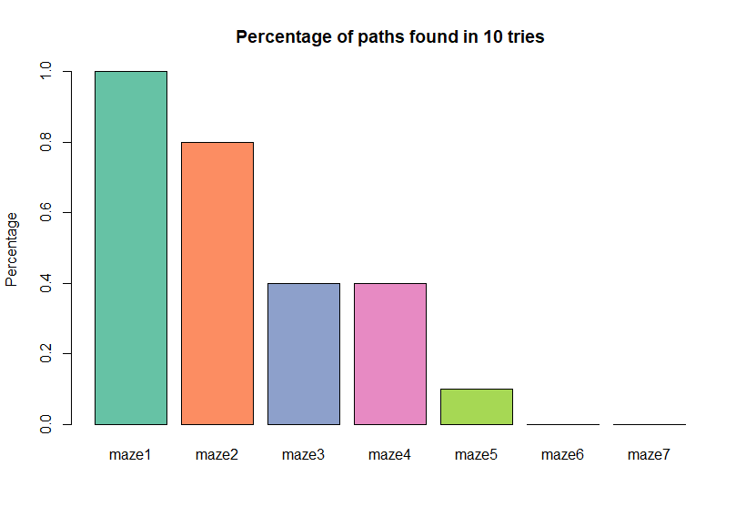

<style>
body { text-align: justify }
</style>

```{r setup, include=FALSE}
knitr::opts_chunk$set(echo = TRUE)
knitr::opts_chunk$set(fig.height=5, fig.width=5, fig.align="center")
library(knitr)
```

\newpage

# Introduction

Genetic algorithms try to mimic the nature's evolution process. Using basic principles of evolution like fitness, mutations and crossovers they are usually used for finding solutions to optimization and search problems.

Initial population of candidates for the solution is generated. Their fitness is evaluated and based on the rating the subjects for mutation and crossover operations are selected. A new generation is created and the process continues until a termination condition is met or the maximum number of iterations has been reached.

In this assignment we tried using the genetic algorithms' optimization properties to optimally solve a maze. We chose to implement the maze path finding algorithm in R programming language using the _[GA](https://cran.r-project.org/package=GA)_ library.

# Representation

The mazes were provided as an array of strings. To make it easier for us to use the data and make it more intuitive we converted the array of strings to a matrix of characters, where '\#' characters represent walls, '.' represent empty spaces, 'T' represent treasures and 'S' and 'E' represent start and finish points of the maze.

```{r}
maze_to_matrix <- function( maze )
{
  nrow <- length( maze )
  ncol <- nchar( maze[1] )
  maze_flat <- unlist( strsplit( maze, '' ) )
  mat <- matrix( maze_flat, nrow, ncol, byrow = TRUE )
  return( mat )
}
```

We chose to represent the path as a vector of integers from 1 to 4, each representing it's own direction. After the genetic algorithm had finished searching for paths the path of the best solution was decoded to characters 'R', 'D', 'L', 'U'.

# Monitoring the Progress

Since the maze was represented as ASCII characters it was very hard to quickly understand what was going on, particularly during execution of the algorithm. That was especially the case when it was changing every few moments. To make it more visually understandable and pleasing we wrote a monitoring function that plots either the best path or all paths every n-th iteration in a friendlier format as a grid.

```{r, echo=FALSE, out.width="75%"}

```

# Measuring the Performance

Two of the most common performance measures for genetic algorithms are the mean of the fitness score of the whole generation and the fitness score of the best individual in each generation. In our case the latter is better suited since we are looking for the best solution.

## Fitness

The fitness function had to be defined so that the better solutions would get a higher rating. Because the path was encoded as a sequence of directions we had to trace the position of the path on the maze from the starting position to evaluate how good a path was.

During path tracing on the maze we checked for wall collisions. Paths through walls are not valid, so the individual is penalized. However, all paths that hit a wall are not equally bad. We decided to encourage paths that travel more tiles in the maze before reaching a wall by computing fitness using the formula `-1 * (max_path_length - path_length)`. Additionally, we also penalized cases when the path revisited a tile by multiplying the fitness score with a penalty factor `(10 * n_backs + 1)`, where n_backs is the number of revisits of tiles in the path.

If the path reaches the end its fitness function is calculated according to path length such that lower path length receives a better score. This can be achieved by evaluating the fitness score as negative path length.

Distance from the last reached tile to the end could also be included in the fitness function calculation. However, for our initial implementation we chose not to include it, as the paths were prematurely converging to a local maximum. Looking for longest possible paths instead encouraged paths to evolve as far away as possible, increasing the chance of finding the end.

```{r}
fitness <- function( path, maze )
{
  start <- which( maze == 'S', arr.ind = TRUE )[1,]
  end <- which( maze == 'E', arr.ind = TRUE )[1,]
  visits <- matrix(0, nrow( maze ), ncol( maze ) )
  visits[start[1], start[2]] <- 1
  max_path_length <- nrow( maze ) * ncol( maze )
  
  path <- as.integer( path )
  pos <- start
  curr <- 'S'
  path_len <- 0
  
  for (move in path) {
    
    path_len <- path_len + 1
    
    # Make a move
    if (move == 1) {
      pos['col'] <- pos['col'] + 1
    }
    else if (move == 2)
    {
      pos['row'] <- pos['row'] - 1
    }
    else if (move == 3)
    {
      pos['col'] <- pos['col'] - 1
    }
    else if (move == 4)
    {
      pos['row'] <- pos['row'] + 1
    }
    
    # Check current position
    curr <- '#'  # Wall by default - for out of bounds cases
    if (1 <= pos['col'] && pos['col'] <= ncol(maze) &&
        1 <= pos['row'] && pos['row'] <= nrow(maze)) {
      visits[pos['row'], pos['col']] <- visits[pos['row'], pos['col']] + 1
      curr <- maze[pos['row'], pos['col']]
    }
    
    # Reached the end or hit a wall
    if (curr == 'E' || curr == '#') {
      break
    }
  }
  
  n_backs <- sum( visits[visits > 0] - 1 )
  
  # Compute fitness score:
  # a) The path goes through walls - fitness based on length of path traveled
  if (curr == '#') {
    return( -1 * (max_path_length + 1 - path_len) * (10 * n_backs + 1) )
    
  # b) End was not reached - fitness based on distance to end
  } else if (curr != 'E') {
    dist <- sum( abs( pos - end ) )
    return( -1 * dist - n_backs )
  
  # c) End was reached - fitness based on path length
  } else {
    return( -1 * path_len - n_backs )
  } 
}
```

We then tested the fitness function by running a genetic algorithm with suitable settings. Our goal was to see how well the algorithm performs with our fitness function and built-in GA mutation and crossover functions.

We experimented with different combinations of built-in mutation and crossover functions. We decided to use a simple _single-point crossover_, which splits a path on a randomly chosen point and produces child paths with the split parts. For mutation we decided to use _displacement mutation_. It works by selecting a random part of the parent path and placing it into a random position outside the selected part.

```{r include=FALSE}
library(GA)
```

```{r, fig.show='animate', out.width="50%"}
source( "mazes.R" ) # Load mazes
source( "draw.R" )  # Drawing functions

maze <- maze_to_matrix( maze2 )
draw_maze( maze )
max_path_length <- nrow(maze) * ncol(maze)

GA <- ga(type = "real-valued",
         fitness = function(path) fitness(path, maze),
         crossover = ga_spCrossover,
         mutation = gaperm_dmMutation,
         lower = rep(1, max_path_length),
         upper = rep(5, max_path_length),
         popSize = 50,
         maxiter = 200,
         elitism = 1,
         pmutation = 0.2,
         pcrossover = 0.8,
         monitor = function(obj) ga_maze_monitor(obj, maze, update_rate = 10, console = FALSE))

path_enc <- GA@solution[1,]
draw_path( maze, path_enc, allow_backtracking = TRUE )
```

We ran the algorithm 10 times for each of the example mazes. The chart below shows a percentage of times any path leading to the end was found. As we expected, the algorithm was not very successful at finding paths. It only worked relatively well for smaller mazes where there are not many different paths and even random mutations to likely invalid moves can eventually lead to a solution.

```{r, echo=FALSE, out.width="75%"}

```

The easiest way of evaluating the fitness of an individual would be to find the shortest path using a different algorithm such as A\* search algorithm and then computing the difference between its solution and our generated sequence. We thought of implementing the fitness function as described above but that would be like building a nuclear power plant to power a coal mine. The genetic algorithm would be useless if we already had the optimal path. Even though it was much slower and usually sub-optimal, our approach gave us a far better understanding of the way genetic algorithms work.

# Mutation

HULK SMASH!!

TODO The mutations were also not as simple as you would think. Making a random mutation on a random position is not very helpful in the finding of a solution. The mutations had to be made on the crossroads with the walls and previous positions being taken into account. They can drastically improve the candidate or they could make it worse. Performance is again evaluated by the fitness function.

# Generating the population

The initial population generating function has to be robust yet it has to satisfy the required format. The first function was as simple as possible. It randomly generated a sequence of moves. The problem with it was that the probability of the sequence actually following a path is next to none and since the moves were completely random the path made no sense. So the function had to be redone to at least take walls and previous positions into account yet remain random and robust.

```{r}
initPopulationAdvanced <- function(object, maze)
{
  lower <- object@lower
  upper <- object@upper
  nvars <- length(lower)
  start <- which( maze == 'S', arr.ind = TRUE )[1,]
  population <- matrix( as.double(NA), nrow = object@popSize, ncol = nvars )
  
  for (i in 1:object@popSize)
  {
    pos <- start
    m <- maze
    visited <- matrix(as.integer(0), nrow(maze), ncol(maze))
    for (j in 1:nvars)
    {
      move <- make_random_move(pos, m, visited)
      population[i,j] <- move
      visited[ pos['row'], pos['col'] ] <- visited[ pos['row'], pos['col'] ] + 1
      #m[pos['row'], pos['col']] <- '#'
      pos <- new_position(pos, move)
    }
  }
  return(population)
}
```

The second initial population generator was far better. If the maze had no crossroads it was solved in the first iteration. The moves remained random but the acknowledgement of walls and previous positions made a huge difference on the overall fitness of the first generation and also later generations. We experimented with ideas such as building the walls on the current position so we can never visit the same position again, but that turned out not to be a successful solution, since the path can run into a dead end with no escape. So alternatively we decided to have an additional matrix the same size as the maze, but with step counters that increment each time the path crosses it, so that the it can loop back yet prevent going in circles.

## R Markdown animation

```{r,animation.hook="gifski"}
```
